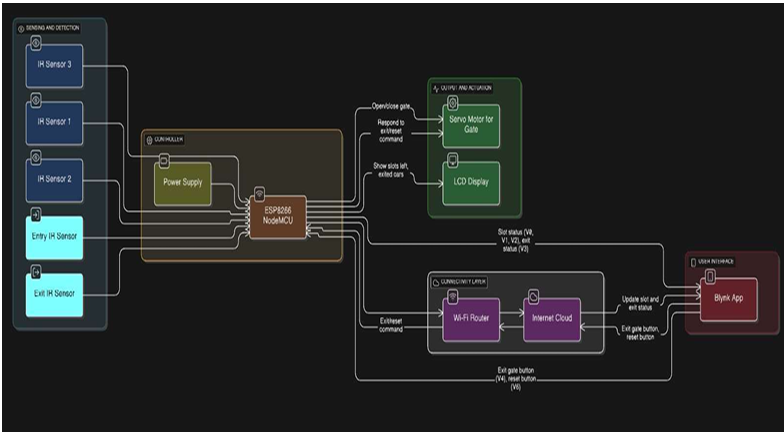
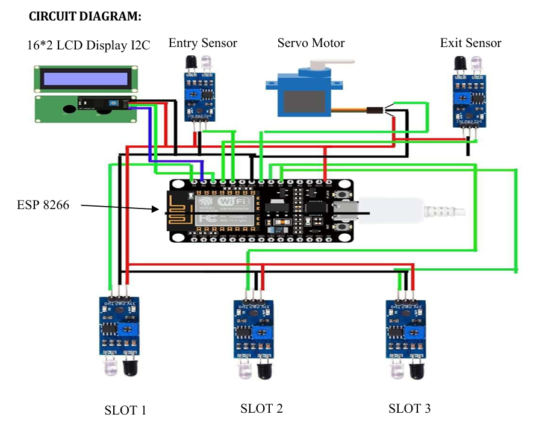
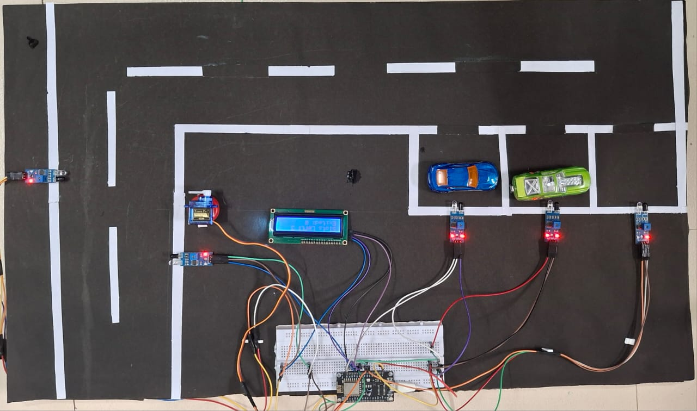

# 🚗 Smart Car Parking System

An IoT-based Smart Car Parking Management System developed using
**ESP8266 NodeMCU, IR sensors, a servo motor, 16×2 I2C LCD, and the
Blynk IoT platform**.

The system monitors parking slot availability, manages vehicle entry
and exit, displays parking information on an LCD, and provides remote
monitoring and control through the Blynk dashboard.

---

## 📌 Project Overview

The Smart Car Parking System is an IoT-based solution designed to
monitor and manage parking spaces in real time.

The system uses IR sensors to detect the presence of vehicles in
three parking slots. An ESP8266 NodeMCU processes the sensor data and
communicates with the Blynk IoT platform over Wi-Fi.

When a vehicle approaches the entry gate, the system checks parking
availability and operates a servo motor to control the gate. Parking
status and the number of exited vehicles are displayed on a 16×2 I2C
LCD and updated on the Blynk dashboard.

---

## ✨ Features

- 🚗 Real-time monitoring of 3 parking slots
- 📡 Wi-Fi connectivity using ESP8266
- 🔴 IR-based vehicle detection
- 🚪 Automatic entry gate control
- 🎛️ Servo motor-based gate mechanism
- 🖥️ 16×2 I2C LCD display
- 📱 Blynk IoT dashboard
- ☁️ Cloud-based parking status monitoring
- 🚘 Exit vehicle counting
- 🔘 Remote exit gate control
- ♻️ System reset through Blynk

---

## 🧠 System Architecture

The system consists of the following major sections:

1. Parking slot and vehicle detection
2. ESP8266-based control unit
3. Servo motor gate control
4. 16×2 I2C LCD display
5. Wi-Fi and Blynk cloud connectivity
6. Blynk mobile dashboard



---

## 🔧 Hardware Components

| Component | Quantity | Purpose |
|---|---:|---|
| ESP8266 NodeMCU | 1 | Main controller and Wi-Fi connectivity |
| IR Sensors | 5 | Parking slot, entry and exit detection |
| 16×2 I2C LCD | 1 | Displays parking information |
| Servo Motor | 1 | Controls the parking gate |
| Breadboard | 1 | Circuit prototyping |
| Power Supply | 1 | Powers the system |
| Connecting Wires | - | Circuit connections |

---

## 💻 Software & Technologies

- Arduino IDE
- Embedded C/C++
- ESP8266
- Blynk IoT
- Wi-Fi Communication
- I2C Communication
- IR Sensor Interfacing
- Servo Motor Control

---

## ⚙️ Working Principle

The system uses IR sensors to detect the presence or absence of
vehicles in the parking slots.

When a vehicle approaches the entry point, the entry IR sensor
detects the vehicle. If a parking slot is available, the available
slot count is decreased and the servo motor opens the gate.

For vehicle exit, the gate can be controlled using a virtual button
on the Blynk dashboard. When the exit gate is activated, the system
increments the exited-car count and increases the number of available
slots.

The current parking information is displayed on the 16×2 I2C LCD and
also transmitted to the Blynk application through Wi-Fi.

---

## 🔌 Circuit Diagram



The circuit integrates the ESP8266 with:

- Three parking-slot IR sensors
- Entry IR sensor
- Exit IR sensor
- Servo motor
- 16×2 I2C LCD

---

## 📱 Blynk IoT Dashboard

The Blynk dashboard provides remote monitoring and control of the
parking system.

### Dashboard Functions

- Slot 1 status
- Slot 2 status
- Slot 3 status
- Exited car counter
- Exit gate control
- Exit sensor status
- System reset


---

## 📸 Project Demonstration

### Hardware Setup



### Parking Model


---

## 🔌 ESP8266 Pin Configuration

| ESP8266 Pin | Connected Device |
|---|---|
| D0 | Slot 1 IR Sensor |
| D6 | Slot 2 IR Sensor |
| D7 | Slot 3 IR Sensor |
| D3 | Entry IR Sensor |
| D4 | Exit IR Sensor |
| D5 | Servo Motor |
| I2C | 16×2 LCD |

---

## 📲 Blynk Virtual Pins

| Virtual Pin | Function |
|---|---|
| V0 | Slot 1 Status |
| V1 | Slot 2 Status |
| V2 | Slot 3 Status |
| V3 | Exit Sensor Status |
| V4 | Exit Gate Control |
| V5 | Exited Car Count |
| V6 | System Reset |

---

## 💻 Source Code

The complete ESP8266 source code is available here:

[`Car_parking.ino`](Code/Car_parking.ino)

### Required Libraries

```text
ESP8266WiFi
BlynkSimpleEsp8266
Wire
LiquidCrystal_I2C
Servo
